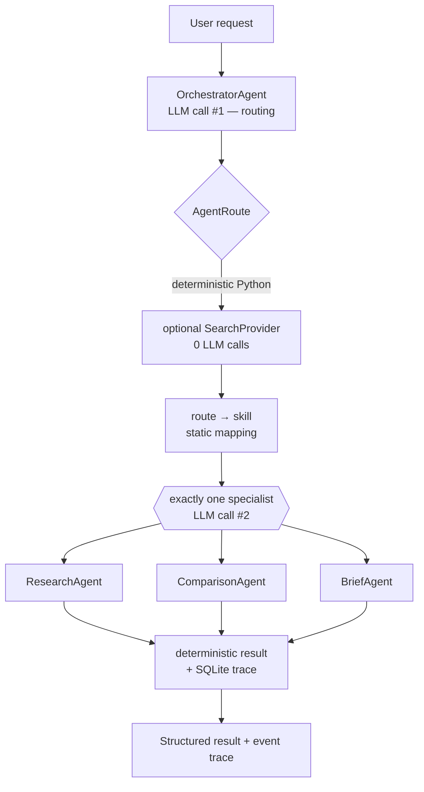

# DecisionForge

A constrained, cost-conscious multi-agent application. You ask a
decision-oriented question; one **orchestrator** classifies it and routes it to
**exactly one** of three specialist agents, which returns a structured answer.
Everything else — the search tool, skill selection, formatting, persistence, the
web UI — is deterministic Python.

Live-demo ready: a FastAPI + vanilla-JS frontend that shows the route, the
specialist, whether search ran, the structured result, and the full execution
trace, deployable on Vercel.



## Overview

DecisionForge answers three kinds of software-decision question:

| Ask | Route | Specialist |
|---|---|---|
| investigate / explain a topic | `research` | **Research Agent** |
| compare options, weigh tradeoffs, recommend one | `comparison` | **Comparison Agent** |
| turn supplied material into an executive brief | `brief` | **Brief Agent** |

The orchestrator makes the routing decision semantically (one LLM call). A
static `route → skill` table and a static `SEARCH_ENABLED_ROUTES` set do the
rest — no second model call to pick a skill or decide whether to search.

## Why this architecture

- **A single generic prompt** handles these requests unpredictably and can't
  specialize.
- **A full agent swarm** (planner, judge, loops, fan-out) is expensive, slow,
  and hard to reason about. An earlier version of this project was exactly that;
  it was deliberately removed (see `docs/architecture.md` → *Architecture
  Reframe*).
- **This design** is the small middle: controlled hierarchical delegation — one
  parent, one child per request — with a hard ceiling on cost.

## Architecture

```
User
 → OrchestratorAgent        semantic routing            (LLM call #1)
 → AgentRoute
 → deterministic Python      dispatch, no second routing step
 → optional SearchProvider   research / comparison only  (0 LLM calls)
 → route → skill (static)    SKILL.md body → specialist prompt
 → exactly one specialist    the work                    (LLM call #2)
 → deterministic Python      format, persist, trace
 → structured result + event trace
```

**Hard rules** (enforced by tests): max **2 LLM calls** per successful request;
**no** retries, loops, fallback agents, or parallel LLM calls; specialists never
call other agents; the LLM only does semantic work.

Full detail and the deployment topology: **`docs/architecture.md`**.

## Agents

Exactly four logical agents:

- **OrchestratorAgent** — classifies the request into one `AgentRoute`. One
  structured model call; returns a `RoutingDecision` (route + short reasoning).
  Does not answer, research, or invoke a specialist.
- **ResearchAgent** — investigates/explains a topic; returns summary, key
  findings, sources, limitations. Won't claim live research or invent citations
  when no evidence is supplied.
- **ComparisonAgent** — compares alternatives; returns options with
  advantages/disadvantages, tradeoffs, a recommendation, rationale, a confidence
  value, limitations.
- **BriefAgent** — transforms user-supplied context into a titled executive
  brief with key points and action items. Requires context; performs no
  research.

Each specialist is a leaf: one model call, no delegation.

## Agent Skills

`skills/{research,comparison,executive-brief}/` — each a `SKILL.md` (YAML
frontmatter + Markdown body) with optional `references/` and `scripts/`. Loaded
with **three-stage progressive disclosure**:

1. **Discovery** — metadata (name, description) only.
2. **Activation** — the SKILL.md body, injected into the selected specialist's
   system prompt.
3. **Extension** — references / scripts, only on explicit request.

The route determines the skill (`app/skills/mapping.py`) — deterministic, no LLM.

## Deterministic tools

`SearchProvider` gathers external evidence **before** the specialist call:

- `MockSearchProvider` / `DemoSearchProvider` — offline, deterministic (the
  default).
- `DuckDuckGoSearchProvider` — optional, no API key (`pip install -e ".[search]"`,
  `SEARCH_PROVIDER=duckduckgo`).

Research and Comparison are search-eligible; **Brief never searches**. Evidence is
rendered to plain text with deterministic size caps (≤5 results, ≤500 chars each,
~2500 total) before it reaches the model. Search adds **zero** LLM calls; a
search failure stops the request with no retry and no fallback.

## Cost-conscious design

| Lever | Value |
|---|---|
| LLM calls per successful request | **2** (1 routing + 1 specialist) |
| Retries | 0 |
| Fallback agents | 0 |
| Parallel LLM calls | 0 |
| LLM calls added by search / skills / persistence / the web layer | 0 |

The UI shows `LLM calls: 2 / 2 max` on every result. This is not autonomous
multi-step reasoning — there are no loops, no self-critique, and the model never
decides to use a tool.

## Tech stack

- **Python 3.12**, `pydantic` v2 for every typed contract.
- **FastAPI** + vanilla HTML/CSS/JS (no framework, no build step).
- Standard-library `sqlite3` for run + event persistence.
- `pyyaml` for SKILL.md frontmatter.
- Optional: `anthropic` (real model calls), `ddgs` (real web search),
  `uvicorn` (local server).
- No LangChain / LlamaIndex / agent framework — the orchestration layer is ~100
  lines of deterministic Python.

## Local development

```bash
python -m venv .venv
source .venv/bin/activate
pip install -e ".[dev]"          # pydantic, pyyaml, fastapi, pytest, httpx
```

Run the web UI (offline, zero cost):

```bash
pip install -e ".[dev,web]"      # adds uvicorn
python scripts/web_demo.py       # http://127.0.0.1:8000
```

Zero-cost CLI demos:

```bash
python scripts/dispatch_demo.py      # end-to-end: request → orchestrator → [search] → one specialist
python scripts/eval_demo.py          # routing accuracy + specialist contract checks
python scripts/skills_demo.py        # progressive disclosure
python scripts/tools_demo.py         # search tool + context builder
python scripts/persistence_demo.py   # one run persisted to a temp SQLite DB + its events
```

Real Claude / real search are opt-in and billable — see `docs/architecture.md`
and the `--live` / `--real-search` flags in the demo scripts. **Do not run
`--live` unless you intend to spend API credit.**

## Vercel deployment

DecisionForge deploys as a single Python serverless function (`api/index.py`) —
no database, no second service.

1. **Push this repo to GitHub.**
2. **Import it into Vercel** (New Project → import). Vercel detects Python from
   `api/index.py` and installs `requirements.txt`. If Project Settings shows an
   old Python version, set it to **3.12** and redeploy.
3. **Set Environment Variables:**

   *Offline demo* — no credentials, no cost:
   ```
   MODEL_PROVIDER=mock
   PERSISTENCE_ENABLED=false
   ```
   *Real Claude demo* — **uses the Anthropic API, may incur charges** (`anthropic`
   is already in `requirements.txt`):
   ```
   MODEL_PROVIDER=anthropic
   ANTHROPIC_API_KEY=<your key>
   ANTHROPIC_MODEL=claude-haiku-4-5
   PERSISTENCE_ENABLED=false
   ```
4. **Deploy** (auto-deploys on every push).
5. **Verify:** open `/` (the UI), then `GET /api/health` →
   `{"status":"ok","model_provider":"mock|anthropic","persistence_enabled":false,...}`.

The deployment is **stateless** — Vercel's filesystem is ephemeral, so
`GET /api/runs` returns `[]` and each `POST /api/runs` response carries the full
result + trace. Durable history is a local feature (`PERSISTENCE_ENABLED=true`).
A successful request is at most 2 LLM calls in every mode.

## Demo

For the 10-minute live demo:

- **`docs/demo-guide.md`** — a minute-by-minute run sheet (no slides).
- **`docs/demo-scenarios.md`** — the three scenarios with exact inputs, expected
  route/skill/search behavior, and the code files to open.

Recommended primary scenario: **Comparison** — it exercises routing, specialist
selection, the search tool, an Agent Skill, structured output, a recommendation
with confidence, and the two-call ceiling in one request.

## Testing

```bash
pytest
```

~300 tests, all offline — the Anthropic SDK and any search backend are mocked;
SQLite uses temp files. Coverage includes the two-call ceiling per route, skill
isolation, search policy, stateless vs. persistent modes, the Vercel entrypoint's
import-safety, and a deterministic routing-evaluation harness
(`app/evaluation/`, `scripts/eval_demo.py`).

## Limitations

- **Not autonomous.** No multi-step reasoning, no loops, no self-critique, no
  model-driven tool use — by design.
- **The offline demo's model outputs are canned** (`DemoModelProvider`). Routing,
  search, skills, persistence and the trace are real; the answers are
  placeholders. Set `MODEL_PROVIDER=anthropic` for real answers.
- **Deployed history is stateless.** Durable run history needs local mode or a
  future `RunRepository` backed by a hosted database.
- **Live web search** is off by default; the DuckDuckGo provider is a snippet
  fetcher, not a crawler.
- **No authentication** — a deployed instance in `anthropic` mode will spend your
  API credit for anyone with the URL.
